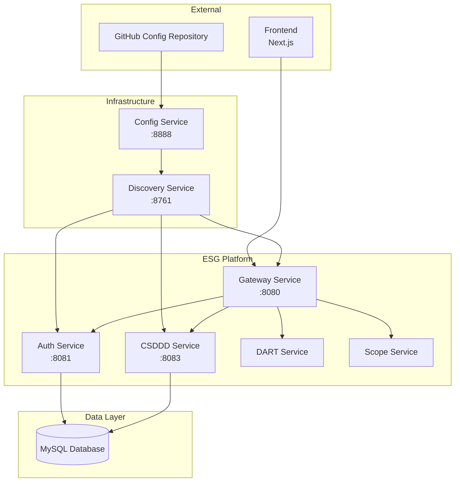
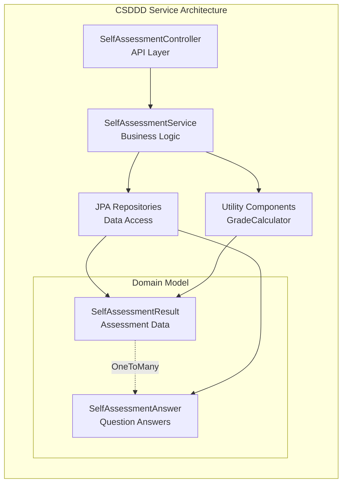
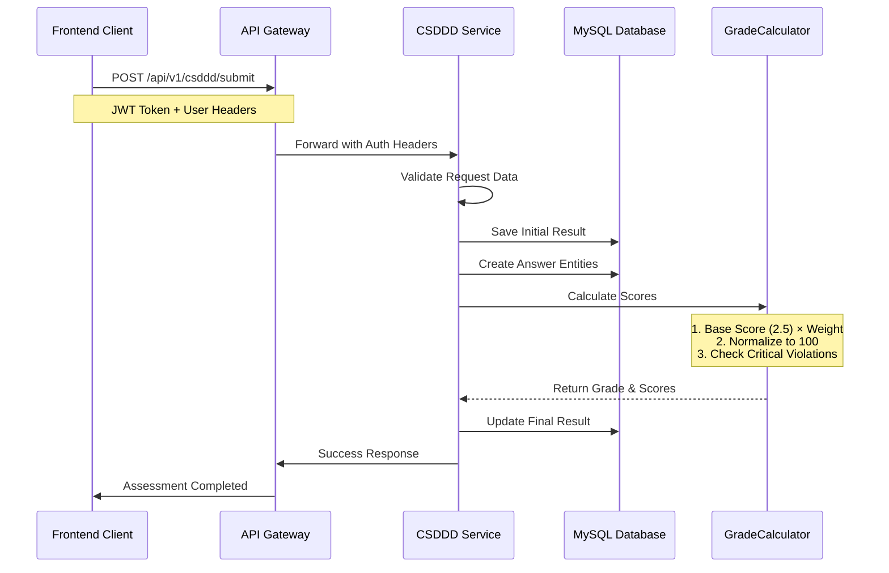
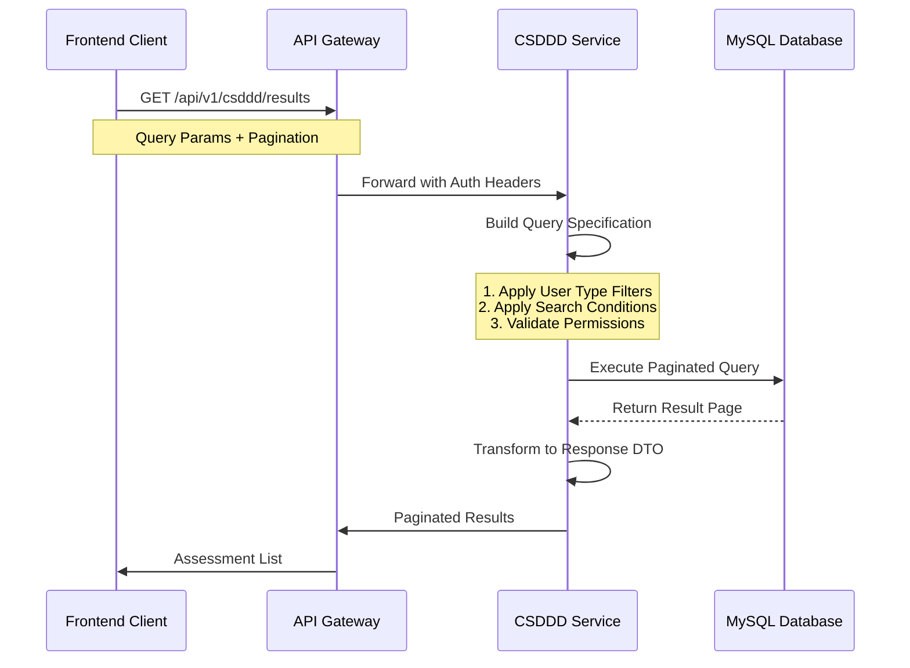
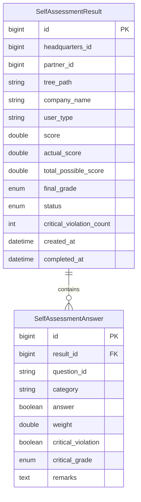

# CSDDD Service - Corporate Sustainability Due Diligence Directive

**포트폴리오 프로젝트**: ESG 플랫폼 - CSDDD 규정 준수 자가진단 서비스

## 프로젝트 개요

CSDDD Service는 유럽연합의 Corporate Sustainability Due Diligence Directive(기업 지속가능성 실사 지침) 규정 준수를 위한 마이크로서비스입니다. 본사와 협력사가 자가진단을 통해 ESG 준수 상태를 평가하고 개선점을 도출할 수 있는 플랫폼을 제공합니다.

### 핵심 기능

- **자가진단 시스템**: CSDDD 규정 항목별 자가진단 제출 및 평가
- **점수 산정**: 가중치 기반 점수 계산 및 A~D 등급 산정
- **중대위반 감지**: 법적 리스크가 높은 항목의 자동 감지 및 등급 강등
- **권한 기반 조회**: 본사/협력사 역할에 따른 데이터 접근 제어
- **조직 계층 관리**: Tree Path 기반 계층적 권한 시스템

### 기술 스택

- **Framework**: Spring Boot 3.5.0
- **Language**: Java 17
- **Database**: MySQL 8.0 + JPA/Hibernate
- **Security**: JWT 기반 인증/인가
- **Documentation**: Swagger/OpenAPI 3.0
- **Build Tool**: Gradle 8.x

## 시스템 아키텍처

### 마이크로서비스 구조



### 컴포넌트 구조



## 자가진단 플로우

### 자가진단 제출 시퀀스



### 결과 조회 플로우



## 데이터 모델

### 핵심 엔티티



## 보안 및 권한

### 계층적 권한 시스템

- **Tree Path**: `/1/L1-001/L2-003/` 형식의 계층 구조
- **본사 권한**: 소속 모든 협력사 데이터 접근 가능
- **협력사 권한**: 자신 및 하위 협력사 데이터만 접근 가능
- **JWT 검증**: Gateway에서 토큰 검증 후 헤더로 사용자 정보 전달

### API 보안 헤더

```
X-USER-TYPE: HEADQUARTERS | PARTNER
X-HEADQUARTERS-ID: {본사ID}
X-PARTNER-ID: {협력사ID} (협력사인 경우)
X-TREE-PATH: {계층경로}
```

## 점수 산정 알고리즘

### 기본 점수 계산

```java
// 기본 점수 = 2.5점 × 가중치
double baseScore = 2.5;
double totalScore = answers.stream()
    .mapToDouble(answer -> baseScore * answer.getWeight())
    .sum();

// 정규화 점수 (0-100)
int normalizedScore = (int) ((actualScore / totalScore) * 100);
```

### 등급 기준

| 등급 | 점수 범위 | 조건 |
|------|-----------|------|
| A | 90-100점 | 중대위반 없음 |
| B | 75-89점 | 중대위반 없음 |
| C | 60-74점 | 중대위반 없음 |
| D | 60점 미만 또는 중대위반 발생 | 강제 강등 |

## 실행 방법

### 개발 환경 구성

```bash
// 핵심 서비스 시작
./backend/run-core-services.sh

// CSDDD 서비스 실행
cd backend/csddd-service
./gradlew bootRun
```

### 환경 변수 설정

```yaml
# application.yml
spring:
  application:
    name: csddd-service
  config:
    import: optional:configserver:http://localhost:8888

server:
  port: 8083
```

## API 문서

### 주요 엔드포인트

| HTTP Method | Endpoint | 설명 |
|-------------|----------|------|
| POST | `/api/v1/csddd/submit` | 자가진단 제출 |
| GET | `/api/v1/csddd/{resultId}` | 자가진단 결과 상세 조회 |
| GET | `/api/v1/csddd/results` | 자가진단 결과 목록 조회 |
| GET | `/api/v1/csddd/violation-meta/{questionId}` | 중대위반 메타데이터 조회 |

### Swagger UI

서비스 실행 후 `http://localhost:8083/swagger-ui.html`에서 API 문서 확인 가능

## 테스트

```bash
// 단위 테스트 실행
./gradlew test

// 통합 테스트 실행
./gradlew integrationTest
```

## 주요 특징

- **확장성**: 마이크로서비스 아키텍처로 독립적 스케일링 가능
- **데이터 무결성**: JPA 트랜잭션 및 양방향 연관관계 관리
- **성능 최적화**: 인덱스 전략 및 페이징 처리
- **모니터링**: 상세한 로깅 및 예외 처리
- **유지보수성**: 계층별 관심사 분리 및 명확한 책임 분담

---

**개발자**: ESG Project Team  
**버전**: 3.0  
**최종 업데이트**: 2024-12-20

